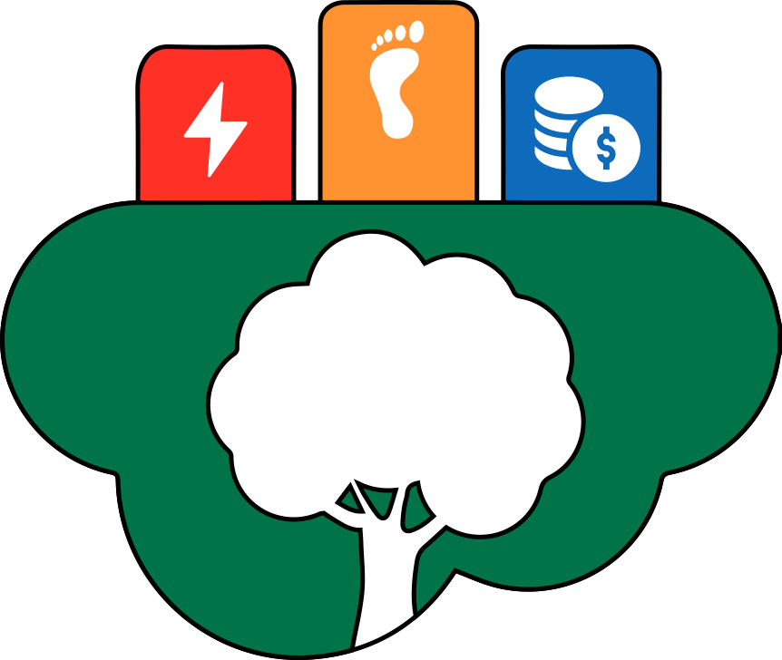

<h1 align="center">
    Cloud Carbon Footprint Transparency Project
</h1>

# Attributions

Tools used:
- [Cloud Carbon Footprint API](https://www.cloudcarbonfootprint.org/)
- [Wekan - Open Source Kanban](https://wekan.github.io/)
- [NextCloud - Open Source Filehosting Service](https://nextcloud.com/)
- [Jellyfin - Open Source Software Media System](https://jellyfin.org/)

Logo design:
- [Chart Icon by Muhazdinata](https://www.flaticon.com/free-icons/chart)
- [Cloud Icon by Freepik](https://www.flaticon.com/free-icons/cloud)
- [Feet Icon by Freepik](https://www.flaticon.com/free-icons/feet)
- [Tree Icon by Freepik](https://www.flaticon.com/free-icons/tree)
- [Money Icon by Freepik](https://www.flaticon.com/free-icons/money)
- [Energy Icon by nawicon](https://www.flaticon.com/free-icons/energy)
